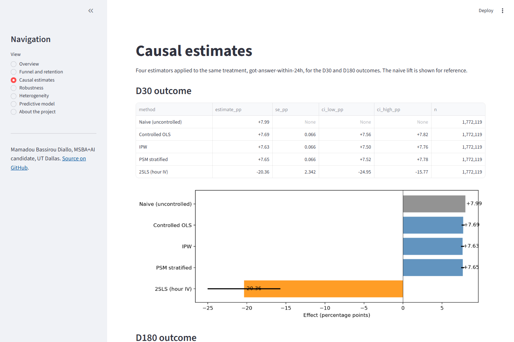

# Stack Overflow new-contributor retention, a causal-inference portfolio project

[](https://github.com/bass990/stackoverflow-causal-retention/actions/workflows/ci.yml)
[](./LICENSE)
[](./pyproject.toml)
[](./Dockerfile)



*The dashboard (`make dashboard` or the Docker image) reads the committed summaries in `data/summary/`. This page is the headline table: three controlled estimators agree, and the instrument fails in plain sight.*

What predicts whether a new Stack Overflow contributor stays active 30 days and 180 days after their first post, and how much of that relationship is actually causal versus just selection on question quality? I built this project to find out, on 1.77M new contributors drawn from the BigQuery public Stack Overflow dataset between January 2018 and September 2022.

## TL;DR

Getting an answer to your first question within 24 hours is associated with **+7.7 percentage points higher D30 retention** (95% CI [+7.56, +7.82], controlled OLS). The effect shrinks to **+1.5 pp at six months**. The headline number is stable across four estimators (OLS, IPW, propensity stratification, with a 2SLS attempted but disqualified), three specifications, and five cohort years. The effect is roughly **1.85x larger in 2022 (+11.03 pp) than in 2018 (+5.96 pp)**, consistent with alternative help sources (Copilot, ChatGPT) making SO answers more differentiating over time.

## Headline numbers

|  | Naive | Controlled OLS | IPW | PSM stratified | 2SLS (hour IV) |
|---|---|---|---|---|---|
| D30 retention lift | +7.99 pp | +7.69 pp | +7.63 pp | +7.65 pp | -20.36 pp (disqualified) |
| D180 retention lift | +1.51 pp | +1.48 pp | +1.47 pp | +1.47 pp | -12.57 pp (disqualified) |

The 2SLS estimate has a first-stage F-statistic above 1000 (so the instrument is not statistically weak), but the strongly negative point estimate is most consistent with an exclusion-restriction violation. Posting hour correlates with unobserved user characteristics (timezone, hobbyist vs professional, urgency of question) that directly affect retention. I report the IV result honestly but treat the regression estimate as the headline.

The four estimators are plain functions in `src/analysis/estimators.py`. They reproduce this table exactly from the master parquet, and `tests/test_estimators.py` checks them on synthetic data with a known effect, including a case where the instrument violates the exclusion restriction and 2SLS goes wrong the same way it did here.

## Cohort-level facts worth knowing

- **2,369,254** total new contributors in the study window, of whom **1,772,119** posted a question first (the modeling sample).
- **24.0%** of question-first contributors are active 30 days later. **4.8%** of the observable subset (86.4% of the modeling sample) are active at 180 days.
- **73.9%** of first questions receive at least one answer. **61.7%** within 24 hours. **45.3%** within 1 hour. The peak posting hour is 14 UTC, when European afternoon overlaps US morning.
- **78.4%** of first questions include a code block. **21.8%** include a link. **5.4%** include an image.

## Where the effect concentrates (heterogeneity)

| Cut | Smallest effect | Largest effect |
|---|---|---|
| Body length quartile | Q1 short: +6.93 pp | Q4 long: +8.33 pp |
| Code block | No code block: +6.54 pp | Has code block: +8.05 pp |
| Primary tag | C++: +3.66 pp | R: +9.96 pp |
| Cohort year | 2018: +5.96 pp | 2022: +11.03 pp |

The language cut is the most striking. R and Android users get nearly three times the retention benefit from an answer as C++ users do. Likely interpretation: smaller-community languages with fewer alternative help sources see SO answers as more valuable, while large-community languages with many alternative resources see SO as one of many places to ask.

## Repo structure

```
stackoverflow-causal-retention/
├── README.md                                  ← you are here
├── LICENSE                                    ← MIT
├── pyproject.toml                             ← deps, requires Python 3.11+
├── Makefile                                   ← make sql-XX, make dashboard, make test, make docker-build
├── Dockerfile                                 ← dashboard image, no BigQuery needed
├── sql/
│   ├── 01_cohort_definition.sql               ← who's in the cohort
│   ├── 02_retention_30d_180d.sql              ← D30 and D180 outcomes
│   ├── 03_funnel_first_post_to_engagement.sql ← first-question funnel
│   ├── 04_leading_indicator_features.sql      ← first-post features
│   └── 05_quasi_experiment_treatment_assignment.sql  ← hour-of-day IV lookup
├── notebooks/
│   ├── 01_eda.ipynb                           ← join, sanity-check, master.parquet
│   ├── 02_retention_model.ipynb               ← OLS, IPW, PSM, 2SLS for D30 and D180
│   ├── 03_robustness.ipynb                    ← treatment / spec / subsample swaps
│   ├── 04_heterogeneity.ipynb                 ← body, code, tag, year cuts
│   └── 05_predictive.ipynb                    ← classifier ladder (v1 baseline through v4 calibrated) + SHAP
├── src/
│   ├── data/bq_client.py                      ← BigQuery wrapper, dry-run cost estimation
│   ├── analysis/estimators.py                 ← naive / OLS / IPW / PSM / 2SLS as functions (notebook 02 uses these)
│   ├── analysis/summaries.py                  ← builds data/summary/ from the notebook outputs
│   └── dashboard/app.py                       ← Streamlit, reads data/summary/ only
├── scripts/publish_space.py                   ← pushes the dashboard to a Hugging Face Space (Docker SDK, paid hosting)
├── huggingface-spaces/README.md               ← Space card
├── docs/
│   └── EXEC_ONE_PAGER.md                      ← PM-facing summary
├── data/
│   ├── processed/                             ← raw extracts + 1.77M-row master table (gitignored, ~130 MB)
│   └── summary/                               ← what the dashboard needs (committed, ~40 KB)
└── tests/                                     ← 23 tests: estimators on synthetic data, summaries, every dashboard page
```

## Quick start

The dashboard runs from the committed summaries, so the first two blocks need no GCP account.

```bash
# Just look at the results
pip install -r requirements-dashboard.txt
make dashboard                       # http://localhost:8501

# Or in Docker
make docker-build && make docker-run # http://127.0.0.1:8501
```

`make publish-space` pushes the same image definition to a Hugging Face Space. Hugging Face now charges for hosting new Docker Spaces, so there is no public URL at the moment; the script is there for when that changes.

To re-run the analysis from BigQuery:

```bash
# Auth into GCP (one time)
gcloud auth login
gcloud auth application-default login
export GCP_PROJECT=<your-project-id>

# Install
python -m venv .venv
.venv\Scripts\activate          # Windows
# source .venv/bin/activate     # macOS/Linux
pip install -e ".[dev]"

# Estimate before running (free, dry-run)
make estimate-sql-01

# Run the SQL pipeline (44 GB total scan, ~$0.22 at $5/TB)
make sql-01 && make sql-02 && make sql-03 && make sql-04 && make sql-05

# Run the notebooks, then rebuild the small summaries the dashboard reads
jupyter lab notebooks/
make summary

# Tests (no BigQuery; estimators run on synthetic data, dashboard renders every page)
make test
```

## Methodology choices

A few decisions worth defending in an interview, with the why-not.

**Why first-post-date and not account-creation-date as the cohort anchor.** Users can create accounts and never contribute. Anchoring on first post filters out lurkers cleanly and matches how a product team would think about a new-contributor cohort.

**Why D30 days 1 through 30, not day 0 through 30.** Every user posts on day 0 by definition. Including day 0 would make active_d30 = 1 for everyone. Days 1 through 30 measures whether they came back.

**Why D180 as a 30-day window after day 180, not "ever posted after day 180."** A binary cleanly interpreted as "still active around the 6-month anniversary." The cumulative version conflates one-time visitors at day 200 with weekly regulars.

**Why linear probability model over logistic for the causal estimate.** The LPM coefficient on a binary treatment IS the percentage-point lift, which is exactly what I want to read across methods. Logit marginal effects require an extra calculation step and don't add to the substantive story.

**Why posting hour as the instrument, and why it ultimately failed.** Posting hour is approximately exogenous to question quality and strongly predicts respondent availability. But it also correlates with user demographics (timezone, hobbyist vs professional) that directly affect retention. The 2SLS estimate is dramatically different from the regression estimates, which is the data telling me the exclusion restriction doesn't hold. Reporting the failure is more honest than burying it.

**Why no Rosenbaum sensitivity bounds.** Originally planned. The IV diagnosis took the place of a formal sensitivity analysis, since the IV-vs-OLS gap directly bounds how much unobserved confounding the regression methods could be missing.

## What I'd want before deploying this for real

1. Continuous data pipeline. The current snapshot ends 2022-09-25 and the BigQuery public dataset is frozen at that point.
2. A real experiment. Stack Overflow could randomize which new questions get fast-track answerer outreach. The causal estimate would close cleanly.
3. Proprietary signals. Logged session time, scroll behavior, multi-tab activity. The +7.7 pp estimate is conditional on observable features; proprietary user-behavior signals would shrink the unobservable-confounder gap.
4. Per-language treatment-effect monitoring. The C++ vs R gap (+3.7 vs +10.0 pp) means a single product policy is leaving value on the table for some communities.
5. Out-of-distribution check on at least one other Q&A platform (Reddit, Discourse-based forums) to see whether the SO-specific dynamic generalizes.

## Honest disclosure

A few things I would call out if someone in an interview pushed on this work.

1. **The +7.7 pp number is not a clean causal effect.** It's the best controlled association I could produce. The 2SLS attempt failed in an informative way (exclusion restriction violated), so I cannot rule out that unobserved confounders (urgency, alternative help sources used, prior programming experience) are inflating the regression estimate.

2. **The treatment is user-correlated, not product-administered.** Receiving an answer depends on the community's behavior toward your question, which depends on your question, which depends on you. Any causal interpretation has to be conditional on the question being the kind that COULD plausibly receive an answer.

3. **Stack Overflow's community in this window is not representative of online help-seeking generally.** Don't extrapolate to Reddit, Discourse, or AI chatbots without doing the work.

4. **Data ends September 2022.** The big shift in how programmers seek help (ChatGPT, late 2022 onward; Copilot, mid-2021 onward) is partly visible in the cohort-year trend but not fully in the post-snapshot world.

5. **Predictive AUC is structurally capped.** Notebook 05 walks a v1-through-v4 ladder: v1 baseline (14 features, untuned) at ROC AUC 0.6212 logit / 0.6362 GBM, v2 with engineered features (52 columns including tag one-hots, polynomials, interactions) at 0.6406 GBM, v3 hyperparameter-tuned at 0.6403, v4 sigmoid-calibrated at 0.6384. The combined improvement over the v1 GBM is +0.44 pp, which is the ceiling for this feature set. Pushing further requires text content (TF-IDF on body / title or embeddings), which would mean re-running sql-04 with the body column kept (~$0.14 in BQ scan). Out of scope here but flagged honestly.

## What went wrong along the way

The first three happened during the June build. The rest I found in September when I came back to bring this repo up to the standard of my later projects, and they are the reason it now has real tests.

**The parquet files would not open.** The BigQuery client writes date columns with its own `dbdate` extension type. Reading them back in a fresh notebook raised `TypeError: data type 'dbdate' not understood`, with nothing in the message pointing at BigQuery. The fix is one line, `import db_dtypes`, which registers the type with pandas. It has to happen before the first read, and every notebook now carries it with a comment saying why.

**Nullable integers broke the regressions.** The same client returns integer columns as pandas' nullable `Int64`. statsmodels and linearmodels both accept the DataFrame and then fail deep inside the formula parser. Casting every model column to float64 fixed it. That cast lives in `prepare_master()` now, so it cannot be forgotten.

**The instrument I designed the study around failed.** Posting hour predicts whether you get a fast answer (first-stage F above 1000) and I had argued it was unrelated to who you are. The 2SLS estimate came out at -20 points against +7.7 from every other method. A valid instrument cannot produce that. Posting hour tracks timezone, and timezone tracks a lot of things about a user that also predict whether they come back. I kept the number in the table, marked disqualified, because an instrument that fails is information about how much unobserved confounding is in play.

**The dashboard was describing a notebook that does not exist.** The predictive page waited for output files from a "notebook 06" and showed a "run notebook 06" placeholder to every visitor. Notebook 05 had absorbed that work months earlier and wrote everything into the files the page was ignoring. Nothing tested the dashboard, so nothing noticed. Every page now renders in CI from the committed summaries, and the page reads the numbers it shows from the artifact instead of from prose I typed.

**A fresh clone had an empty dashboard.** All the parquet outputs were gitignored, so anyone who cloned the repo needed a GCP project, $0.22 of BigQuery scan and five notebook runs before `make dashboard` showed a single number. The six result tables total about 40 KB. They are committed now under `data/summary/` with a builder script, and the 130 MB of raw extracts stay ignored. The Docker image is built from those 40 KB. I also wrote the script to push it to a Hugging Face Space and hit two walls in a row: Hugging Face no longer creates Streamlit-SDK Spaces (only Gradio, Docker or static), and once I switched to the Docker SDK it answered 402, because hosting a new Docker Space now needs a paid plan. My two older Spaces predate both rules. The script stays in the repo; the public URL will exist when the hosting question is settled.

**Pulling the estimators out of the notebook, and the tests I got wrong.** The four estimators were notebook cells. I moved them into `src/analysis/estimators.py` and checked the module against the saved notebook output on the real 1.77M rows: all ten rows match to the last digit. Then I wrote tests on synthetic data with a known 8-point effect, and two of them failed on the first run for reasons that were mine. The 2SLS test used an instrument that barely moved treatment, so the estimate was correct on average and 5 points off in that draw. And the exclusion-violation test compared 2SLS against an OLS that had the instrument variable omitted as a control, so OLS was biased too. In the real study OLS keeps posting hour as a control and only the IV drops it. Once the test mirrored that, OLS landed within a point of the truth and 2SLS went negative with a non-overlapping interval, which is exactly the pattern in the headline table.

**A deprecated argument on every table.** Streamlit's `use_container_width` is scheduled for removal, and the dashboard used it 14 times. Replaced with `width="stretch"` and the version floor raised so the argument exists.

## Tech stack

Python 3.11+ (built and run on 3.12 and 3.14), BigQuery, pandas, numpy, statsmodels (OLS, IPW), linearmodels (2SLS), scikit-learn (HistGBM, logistic), SHAP (feature attribution), Streamlit (dashboard), pyarrow, pytest, ruff, Docker, GitHub Actions CI.

## License

[MIT](./LICENSE). Not affiliated with Stack Exchange Inc. Data is accessed from the public BigQuery dataset `bigquery-public-data.stackoverflow` under [Stack Exchange's CC BY-SA license terms](https://stackoverflow.com/help/licensing).

## Author

Mamadou Bassirou Diallo · MS Business Analytics & AI, UT Dallas · [LinkedIn](https://www.linkedin.com/in/mamadou9905) · [GitHub](https://github.com/bass990)
